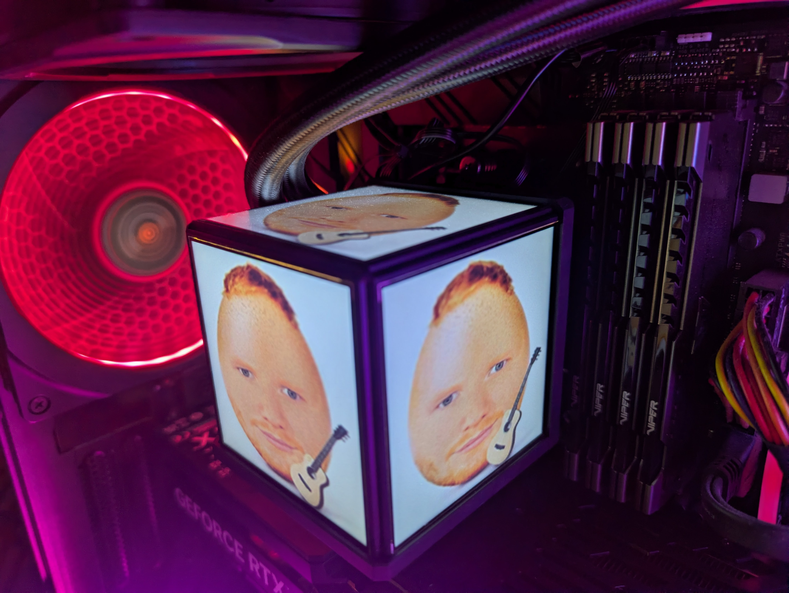
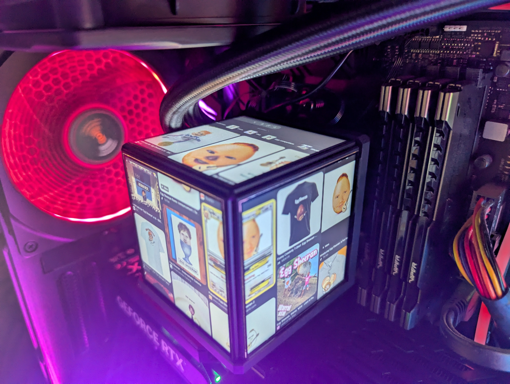
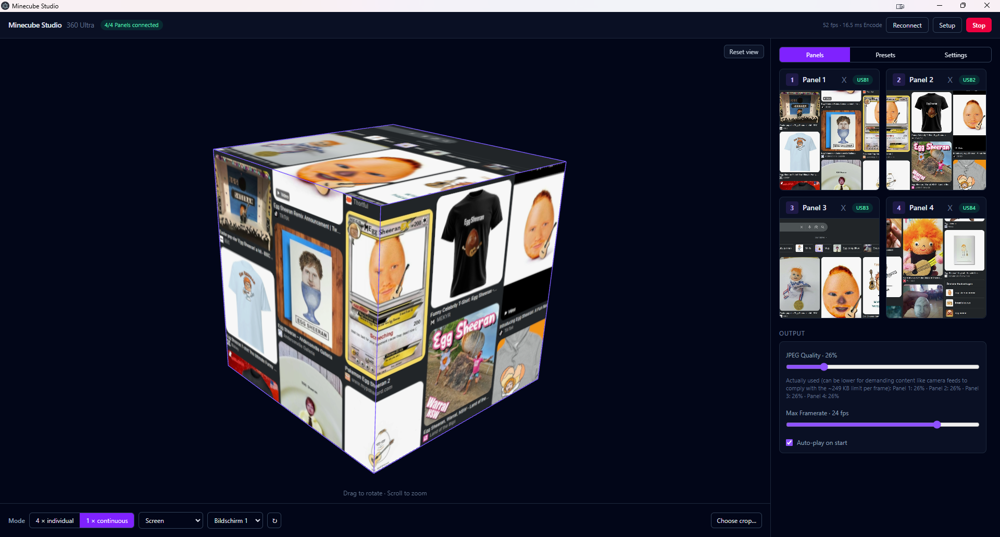
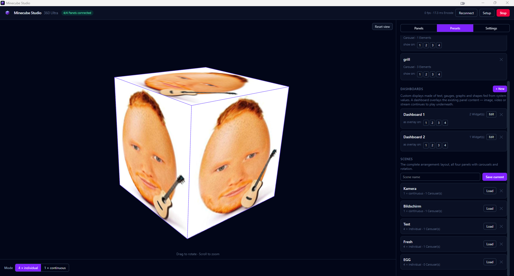

# 🧊 Minecube Studio

**A free, open replacement for the Thermaltake Minecube 360 Ultra AIO's
official software — with a lot more up its sleeve.**

The stock Thermaltake app lets you put an image on each of the cube's four
panels. That's it. Minecube Studio speaks the panel's USB protocol directly
(no Thermaltake software installed, no dependency on it at all) and builds a
real content engine on top: live camera feeds, animated system dashboards,
carousels, scenes, security-camera pop-ups — all running quietly in the
background, all for free.

<p align="center">
  
  
</p>

<p align="center">
  <a href="https://youtu.be/2rNq9Gi1Xk8">
    
  </a>
  <br>
  <sub>▶ <a href="https://youtu.be/2rNq9Gi1Xk8">Watch the demo video</a></sub>
</p>

<p align="center"><sub>🎸 Yes, that's a real cube on a real PC, running a meme carousel — because it can.</sub></p>

---

## ✨ Features

- 🖼️ **Any content, on every panel** — images, video, GIFs, solid colours, live camera streams, screen capture, or a fully designed live dashboard
- ✂️ **Freely positioned crop** on every source, with a live drag-to-place editor
- 🎠 **Carousels** — a per-panel playlist with custom timing, shuffle, and smart "let the video finish" logic
- ⭐ **Presets & scenes** — save and instantly re-apply single-panel content or a whole four-panel arrangement
- 🧊 **Unified mode** — wrap one continuous image or video seamlessly around all four panels
- 📊 **Live dashboard designer** — a drag-and-drop canvas for building real-time system stats (CPU, RAM, GPU, network, disks, temps)
- 📷 **Frigate + MQTT camera pop-ups** — a panel automatically shows a security camera the instant it detects a person, then reverts on its own
- 🔧 **Guided setup mode** — panels display big numbers so you can tell them apart, then assign, swap and rotate them visually
- 🌐 **English & German UI**, switchable anytime
- 🔋 **Genuinely idle-friendly** — a static panel costs about 2.5% of one CPU core, not 100%
- 🚀 **Launches with Windows**, straight into the tray, no window in your way

---

## 📖 Features in detail

### 🖼️ Any content, on every panel
Point a panel at a still image, a video, an animated GIF, a flat colour, a
live camera (go2rtc or Frigate, over WebRTC or MJPEG), your desktop, or a
dashboard — independently, per panel. Mix and match freely across all four.

### ✂️ Freely positioned crop
Every source gets its own crop editor: drag a box over a live preview of the
*actual* source, not a static thumbnail. "Keep square" snaps the box to the
panel's own aspect ratio so nothing gets stretched once it lands on the cube.

### 🎠 Carousels
Turn any panel into a slideshow — queue up videos, GIFs and images with a
shared or per-item display duration. "Play videos to the end" waits for the
clip to actually finish before advancing, while a still image never blocks
the queue forever.

### ⭐ Presets & scenes
A **preset** is one panel's content, saved and droppable onto any display
with a click. A **scene** is the entire cube's arrangement — mode, all four
panels, their carousels, their rotation — saved and restored in one shot.
Cycle through your saved scenes with a single global hotkey, even while the
window is minimized.

### 🧊 Unified mode
Instead of four independent panels, treat the whole cube as one continuous
virtual canvas that gets sliced up across the visible faces — perfect for a
single wraparound image, video, or screen mirror. The screenshot below shows
it live, mid-rotation in the built-in 3D preview:

<p align="center"></p>

### 📊 Live dashboard designer
Build your own real-time system-stats display with a proper drag/resize
canvas editor: text, gauges, graphs, shapes and icons, each bound to a live
metric — CPU load, RAM, GPU, per-drive disk usage, network throughput — read
straight from the OS with **zero extra background processes**. Plug in
[LibreHardwareMonitor](https://github.com/LibreHardwareMonitor/LibreHardwareMonitor)
for temperatures and fan speeds too. A dashboard overlays on top of whatever
the panel is already showing, so your video or carousel keeps playing right
underneath the stats.

### 📷 Frigate + MQTT camera pop-ups
Configure a rule — camera, object label (e.g. "person"), target panel, and a
minimum on-screen duration — and Minecube Studio listens directly to your
existing MQTT broker for Frigate's detection events. The moment something's
detected, that panel switches to the live camera automatically, and reverts
back to whatever it was showing once the coast is clear (and your minimum
duration has been honoured). No Home Assistant required.

### 🔧 Guided setup mode
Four identical-looking panels, one USB hub — good luck telling them apart by
eye. Setup mode throws a giant number on each physical panel so you can match
it to its card in the UI, then assign, swap, and rotate from there.

### 🗂️ Presets, dashboards and scenes, all in one place
Everything above comes together in one management view — carousels, saved
dashboards with their own overlay targets, and full scenes ready to load:

<p align="center"></p>

---

## 📦 Installation

Grab the latest installer from the [**Releases**](https://github.com/bejak1999/minecube-studio/releases/latest)
page — `minecube-studio Setup <version>.exe` — and run it. It installs for the
current user, adds a Start Menu entry and an uninstaller, and can optionally
launch with Windows straight into the tray.

> ⚠️ The installer is unsigned (no code-signing certificate), so Windows
> SmartScreen will likely flag it on first run. Click **More info → Run
> anyway**.

## 🛠️ Building from source

Requires **Node 20+** and, for `node-hid`'s native module, the
[Visual Studio Build Tools](https://visualstudio.microsoft.com/visual-cpp-build-tools/)
(Desktop development with C++ workload).

```bash
cd studio
npm install     # also rebuilds node-hid against Electron's own ABI
npm run dev     # start the app with hot reload
npm run check   # typecheck + test suite
npm run dist    # build a Windows installer into dist/
```

## 🧠 How it works

The panels' USB protocol was reverse engineered from scratch from a USB
capture — see [`PROTOCOL.md`](PROTOCOL.md) for the wire format itself. The
app's architecture, its extension points, and a list of bugs that cost real
debugging time are all written up in
[`studio/README.md`](studio/README.md).

## 📜 License

[GNU General Public License v3.0](LICENSE) or later. See [`LICENSE`](LICENSE)
for the full text.
